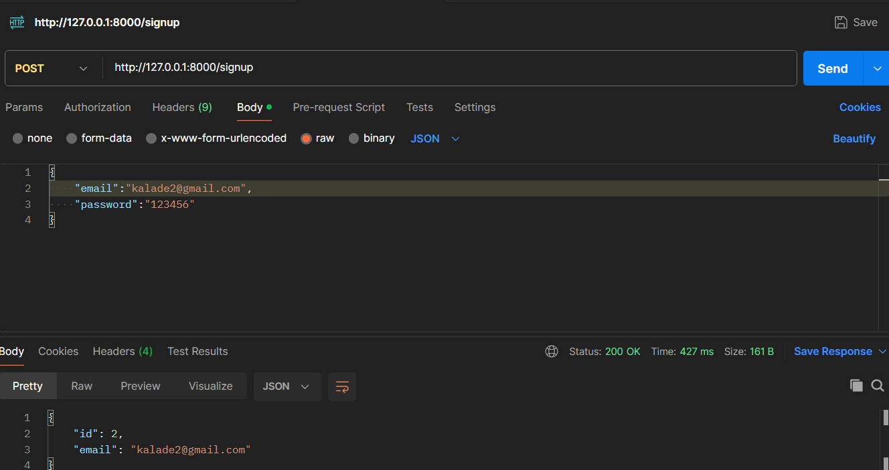
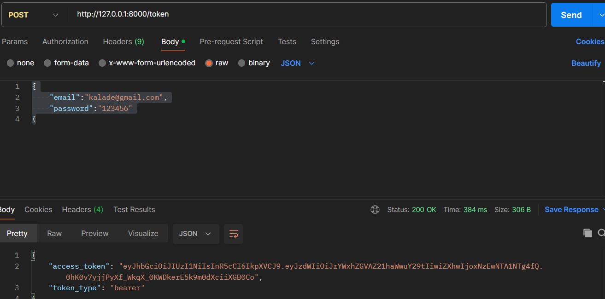
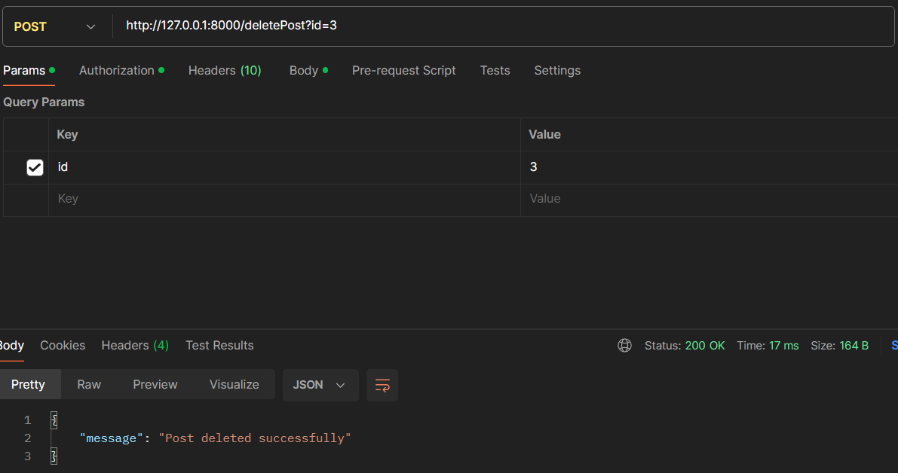

# lucidreams

### Run with

```uvicorn
pip install -r requirements.txt

uvicorn app.main:app --reload

Test in Postman or Thunderclient
```

## Calling APIs

### Sign up a user

```
POST http://127.0.0.1:8000/signup

{
    "email":"kalade@gmail.com",
    "password":"123456"
}
```



### Login to obtain token

```
POST http://127.0.0.1:8000/token

{
    "email":"kalade@gmail.com",
    "password":"123456"
}
```



### Get All Posts

```
GET http://127.0.0.1:8000/getPosts

Add the bearer token you got from above here
```

### Add a Post

```
POST http://127.0.0.1:8000/addPost

Remember to add the token here too
{
    "title":"Lorem Ipsum 11",
    "content":"Lorem Ipsum is simply dummy text of the printing and typesetting industry. Lorem Ipsum has been the industry's standard dummy text ever since the 1500s, when an unknown printer took a galley of type and scrambled it to make a type specimen book. It has survived not only five centuries, but also the leap into electronic typesetting, remaining essentially unchanged. It was popularised in the 1960s with the release of Letraset sheets containing Lorem Ipsum passages, and more recently with desktop publishing software like Aldus PageMaker including versions of Lorem Ipsum."
}


```

### Delete a post

```
POST http://127.0.0.1:8000/deletePost?id=id
```


